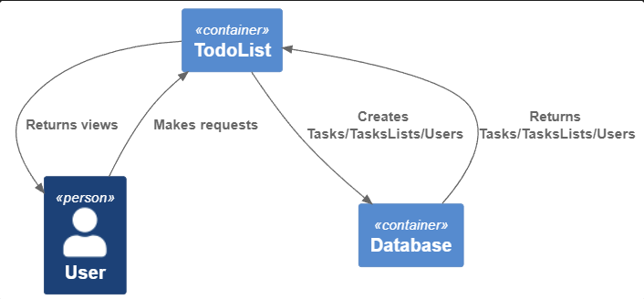
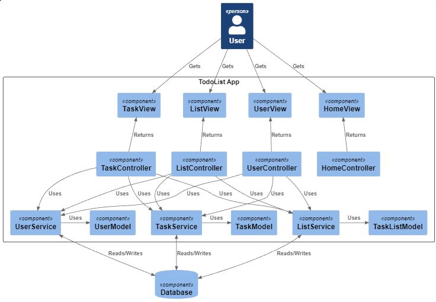
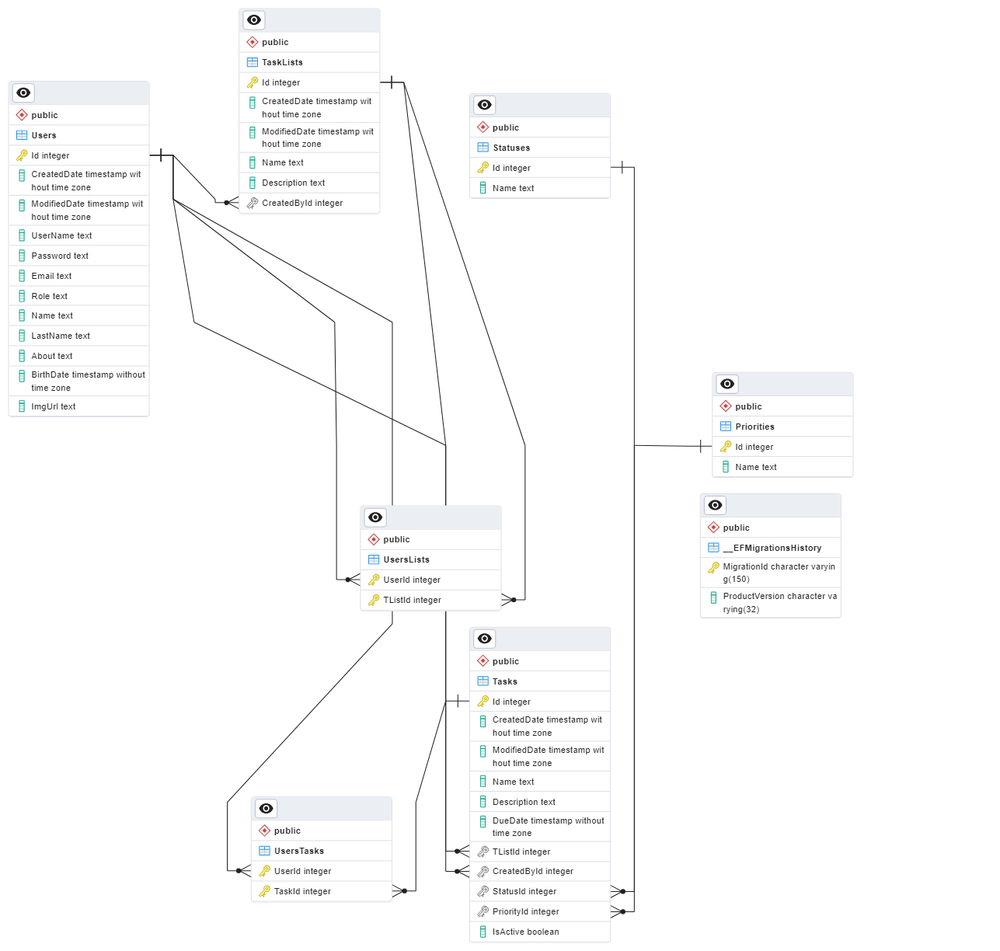
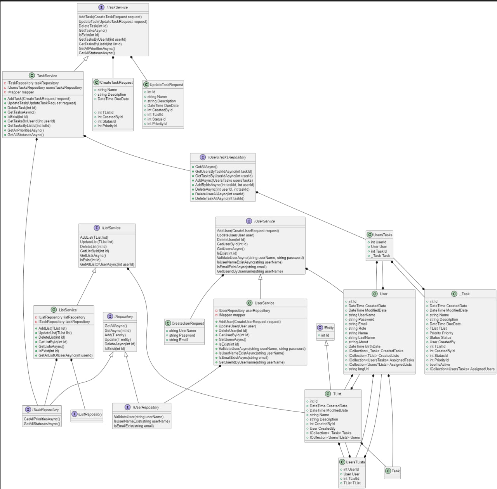
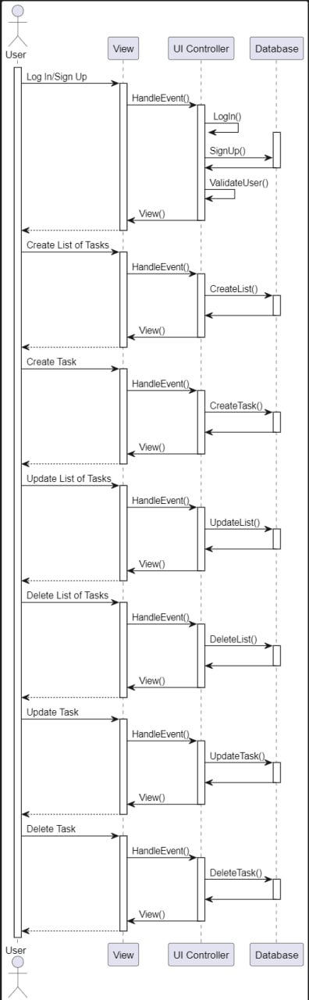

# Todo list project for Software Architecture

The Todo list project is a web application that allows users to create, read, update, and delete tasks.
The architecture of the Todo list project is three-tier, using Model-View-Controller (MVC) architecture.

Quality attributes:
- Security
- Availability
- Scalability

#### C4 Diagram (Context)

#### C4 Diagram (Component)

  

#### ER-diagram

  

#### Class diagram

  

#### Activity diagram

  

